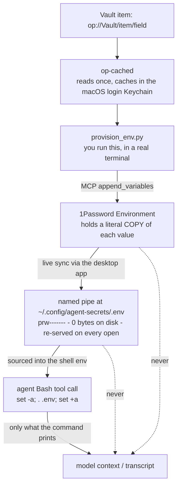

# agentic-secrets

**Give an AI coding agent real credentials without any secret value entering the model's context window.**

The trick is a 1Password *Environment* mounted as a **named pipe**. The agent runs
one line of shell, the values land in that shell's environment, and the model
never sees them — not in the transcript, not in `argv`, not in a dotfile on disk.

```bash
set -a; . "$HOME/.config/agent-secrets/.env"; set +a
curl -sS -H "Authorization: Bearer $EXAMPLE_API_TOKEN" https://api.example.com/v1/ping
```

The model wrote both lines. It has never seen the token, and never will.

---

## The problem

An agent that can run shell commands needs credentials to be useful — deploy
keys, API tokens, a `sudo` password. Every obvious way of supplying them leaks:

| Approach | Leak |
|---|---|
| Paste the secret into the chat | In the model's context and in the transcript, forever |
| `export TOKEN=hunter2` in a tool call | Same, plus it's in the command the agent *wrote*, so it's in the context twice |
| `curl -H "Authorization: Bearer $(op read op://...)"` | No leak into context, but `op read` re-prompts Touch ID on nearly every call (see below) |
| A plaintext `.env` in the repo | On disk, in backups, one `cat .env` away from the context |
| `TOKEN=$(cat secret.txt) ./deploy` | Value is in `argv` — visible in `ps` to every process on the box |
| An MCP tool that returns the secret | Tool results *are* context. This is the worst one, and the easiest to build by accident |

What you actually want: the agent can **use** a credential but has no path to
**read** one.

## The pattern



Plain text version of the same data flow:

```
1Password vault item
      |  (op-cached: one Touch ID per work session)
      v
provision_env.py  --- run by a human, prints NAMES ONLY --->  stdout
      |
      |  MCP append_variables (in-process, stdio, never via an agent tool call)
      v
1Password Environment  ---- live sync ---->  ~/.config/agent-secrets/.env
                                              (FIFO: prw-------, 0 bytes)
                                                      |
                        agent writes:  set -a; . "$HOME/.config/agent-secrets/.env"; set +a
                                                      |
                                                      v
                                        values live only in that shell's
                                        environment, for that one command
```

Three properties do the work:

1. **The mount is a named pipe, not a file.** `ls -l` shows `prw-------`, size
   `0`. There is nothing on disk to `cat` accidentally, nothing to land in a
   backup, nothing to commit. The 1Password desktop app re-serves the content
   on every open.
2. **Sourcing puts values in the shell environment, not in `argv`.** They never
   appear in `ps`, never appear in the command string the model wrote, and
   never appear in the tool result unless the command itself prints them.
3. **It needs no tty and no per-read biometric prompt** — only the 1Password
   desktop app running and unlocked. That is what makes it usable from an agent
   harness, where every Bash call is a fresh non-interactive process.

### Why not just `op read`?

1Password CLI ties authorization to a *terminal session*, identified by tty plus
start time. That authorization lasts 10 minutes of inactivity with a 12-hour
hard cap, and [none of it is
configurable](https://developer.1password.com/docs/cli/app-integration-security/).
An agent's Bash calls have no stable tty, so every `op read` looks like a brand
new session and re-prompts Touch ID. In practice that means a biometric prompt
per command, which is where people give up and paste the secret into the chat.

The bundled [`op-cached`](./op-cached) fixes that for the provisioning path: it
caches the value in the **macOS login Keychain** (encrypted at rest, never a
plaintext file), keyed by the SHA-256 of the `op://` ref, with an 8-hour TTL.
One Touch ID unlock covers a whole work session.

Two details in it are worth stealing:

- The value is **hex-encoded and piped to `security -i` on stdin**, so it never
  appears in `argv` even during the store.
- `security -i` silently truncates its input line at 4096 bytes, which would
  cache a corrupt entry that later reads serve without complaint — so oversized
  secrets are deliberately **not cached**, just passed through.

`op-cached` is the *fallback and bootstrap* path. Once the Environment is
mounted, day-to-day agent work uses the FIFO and touches `op` not at all.

---

## Setup

Requirements: macOS, the 1Password desktop app (unlocked), the `op` CLI with
"Integrate with 1Password CLI" enabled in Settings → Developer, and 1Password's
Environments MCP server (enabled in the desktop app; in current builds it lives
under Labs). Python 3.11+ for the TOML config — 3.9/3.10 work if you write the
config as JSON.

**1. Install the reader.**

```bash
install -m 0755 op-cached ~/.local/bin/op-cached
op-cached "op://Vault/some-item/password" >/dev/null && echo "reader ok"
```

If you manage your Mac with nix-darwin / home-manager, don't vendor it — point
at your own copy instead:

```nix
home.file.".local/bin/op-cached" = {
  source = ./dotfiles/op-cached.sh;   # your own dotfiles path
  executable = true;
};
```

(This script is vendored from the author's dotfiles; same author, MIT.)

**2. Write the config.**

```bash
cp example.config.toml config.toml
```

Fill in `account_id` — `op account list --format=json` prints it. Leave
`environment_id` for the next step. List your secrets under `[[variables]]`, each
with the `op://` reference it comes from.

**3. Create the Environment and note its id.**

```bash
./provision_env.py create-environment agent-secrets
# copy the printed id into config.toml as environment_id
```

Already have one? `./provision_env.py list-environments`.

**4. Check the plan, then provision.**

```bash
./provision_env.py provision --dry-run   # reads nothing, writes nothing
./provision_env.py provision
```

Output is variable names and `read ok` / `append ok`. No value is ever printed.

**5. Mount it.**

```bash
./provision_env.py mount
ls -l ~/.config/agent-secrets/.env    # expect: prw-------  ... 0 ...
```

The leading `p` is the whole point. If you see `-rw-`, it is a regular file and
you do not have this pattern.

**6. Tell your agent the one line.**

Put this in the project's `CLAUDE.md`, `AGENTS.md`, or equivalent:

> Secrets come from the mounted Environment at `~/.config/agent-secrets/.env`.
> Read them with `set -a; . "$HOME/.config/agent-secrets/.env"; set +a` and use
> the variables by name. Never print a value, never pass one on a command line,
> never write one to a file. Available names: `EXAMPLE_API_TOKEN`, …

Note the *names* belong in that file. The names are not secret and the agent
needs them; the values are and it doesn't.

### Bonus: HTTP MCP servers that need a bearer token

Same idea, different consumer. Claude Code's `headersHelper` runs a shell command
and uses its stdout as the request headers, so the token never appears in the MCP
config on disk:

```json
{
  "type": "http",
  "url": "https://mcp.example.com/api",
  "headersHelper": "printf '{\"Authorization\": \"Bearer %s\"}' \"$($HOME/.local/bin/op-cached 'op://Vault/item/credential')\""
}
```

Add it with `claude mcp add-json` — plain `claude mcp add` drops the field.

---

## Caveats

These are properties of 1Password's Environments feature, not bugs in this repo.
Both will bite you eventually. Know them up front.

### 1. An Environment stores a *copy*, not a reference

Putting a value in an Environment copies the literal string. It does **not**
store an `op://` pointer that gets resolved on read — an `op://…` string written
into a variable comes back through the mount verbatim, unresolved.

Consequence: **rotating the vault item does not propagate.** The Environment
keeps serving the old value until you update it. After any rotation:

```bash
op-cached --refresh "op://Vault/item/field"   # bust the Keychain cache first
./provision_env.py provision --only THAT_VARIABLE
```

...or edit the value in the 1Password app, which is cleaner — see caveat 2.

### 2. `append_variables` duplicates instead of updating

Appending a name that already exists adds a **second row**; it does not replace
the first. The MCP server exposes no delete tool (`authenticate`,
`append_variables`, `create_environment`, `rename_environment`,
`list_environments`, `list_variables`, `create_local_env_file`,
`list_local_env_files` — that's the whole surface).

When a shell sources the mounted `.env`, later assignments overwrite earlier
ones, so **the last occurrence wins** and a re-run does give you the new value.
But dead rows accumulate.

So: for an **update**, edit the value in the 1Password app (Developer →
Environments) and delete strays there. Use `provision` for **initial**
population, and accept the duplicate row when you use it for rotation.

### 3. The provisioner is for humans, not agents

The MCP `append_variables` tool takes the value as a *tool argument*. If an
agent calls it, the plaintext secret is in the model's context — exactly what
this whole repo exists to prevent. That is why provisioning is a script you run,
which pipes JSON-RPC to the server in-process.

(Having an agent call `append_variables` for a **freshly generated** token that
the agent created and no one has yet stored is fine — nothing is being
exfiltrated. Using it to move an *existing* secret is not.)

`list_variables` is safe for an agent: it returns names only.

### 4. Platform

`op-cached` is macOS-specific (`security`, the login Keychain). The Environment
mount itself is a 1Password desktop feature. Nothing here is portable to Linux
CI as written; on Linux you'd want a different reader and probably a different
mechanism entirely.

---

## Threat model

Be honest about the shape of this thing. It is an **exfiltration control**, not a
sandbox.

### What it protects against

- **Secret in the model's context window.** The value never appears in a prompt,
  a tool argument, or a tool result. Nothing to memorize, nothing to regurgitate
  into a later answer.
- **Secret in the transcript.** Chat logs, session files, and any telemetry built
  on them get variable names and exit codes. If a transcript is later shared,
  pasted into a bug report, or used as training data, there is no credential in it.
- **Secret in `argv`.** Values are sourced into the environment, not interpolated
  into command lines. `ps` shows nothing. `op-cached` maintains the same property
  when writing to the Keychain.
- **Secret in a plaintext dotfile.** The mount is a FIFO: zero bytes on disk,
  nothing for a backup daemon, a file-sync client, an editor's recent-files
  index, or `git add -A` to pick up.
- **An agent misreading its instructions and echoing config.** `cat`-ing the
  mount is the one obvious mistake, and it prints the values — but the agent has
  to actively do that, and it is trivially visible in the transcript when it
  happens. Compare with a plaintext `.env`, where the same mistake is one
  incidental `cat` during unrelated debugging.

### What it does NOT protect against

- **A compromised local machine.** If an attacker runs code as your user while
  1Password is unlocked, they can open the FIFO and read everything, and they can
  read the `op-cached` Keychain entries with the `security` CLI. There is no
  boundary here that a local attacker doesn't already sit inside.
- **The agent itself, if it can run arbitrary shell.** It can `cat` the mount. It
  can `env`. It can source the file and `curl` the values to a server it picked.
  This pattern removes the *accidental* leak into context; it does not sandbox a
  hostile or hijacked agent. If your threat model includes prompt injection
  driving deliberate exfiltration, you need command allowlisting, egress
  filtering, or a broker process that performs the authenticated action and never
  hands the credential over — not this.
- **Misuse of the credential.** An agent that can use a deploy key can deploy.
  Scope every credential to the least it can be scoped to, and prefer separate
  low-privilege items for agent use over sharing your own.
- **Secrets in command *output*.** If the agent runs something that prints a
  token — a verbose HTTP trace, `env`, a debug endpoint — that output goes
  straight into the context. The mount does nothing about it. Prefer `curl -sS`,
  and never `set -x` a block that touches these variables.
- **`op-cached`'s Keychain cache.** Any process running as you can read those
  entries while the login Keychain is unlocked. That is a deliberate trade
  against authorization fatigue, bounded by an 8-hour TTL and a handful of
  cached fields. `op-cached --clear` wipes them.
- **Anything outside macOS + 1Password.** See caveat 4.

### The one-line summary

> The model can hold the key ring without ever seeing the keys. It can still
> open every door the keys open.

---

## Files

| File | What it is |
|---|---|
| [`provision_env.py`](./provision_env.py) | Reads `op://` refs, pushes values into an Environment over stdio MCP. Prints names only. `--dry-run` supported. |
| [`example.config.toml`](./example.config.toml) | Copy to `config.toml`, fill in your ids and refs. |
| [`op-cached`](./op-cached) | `op read` with a login-Keychain cache. Vendored from the author's dotfiles (same author, MIT). |

## Prior art and references

- 1Password Environments: <https://www.1password.dev/environments/>
- Local `.env` mounts: <https://www.1password.dev/environments/local-env-file/>
- Why `op read` re-prompts:
  <https://developer.1password.com/docs/cli/app-integration-security/>

## License

MIT. See [LICENSE](./LICENSE).
